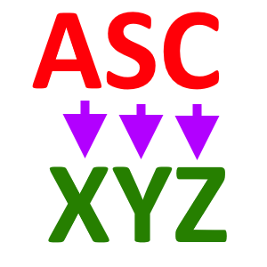

# Algorytmy Krystiana

Wtyczka zawierająca proste algorytmy wykorzystywane na potrzeby realizowanych zadań.

## Instalacja
Folder algorytmy_krystiana należy skopiować do folderu z pluginami aktywnego profilu QGiS.  
Zazwyczaj jest to folder:   
<i>C:\Users\ NAZWA_UZYTKOWNIKA \AppData\Roaming\QGIS\QGIS3\profiles\default\python\plugins

## **Narzędzia są podzielone na grupy tematyczne:**

#### **ASC**
* Konwersja ASC na XYZ i usunięcie wierszy z NO DATA     

## AUTOR
tmazuga@gmail.com
